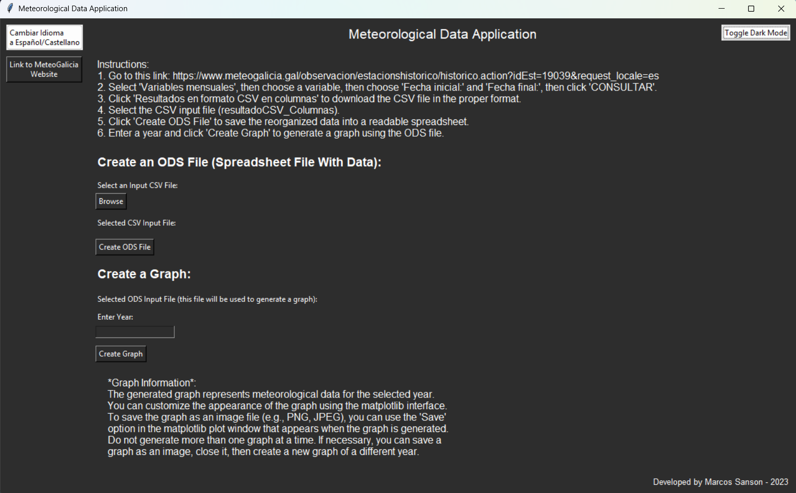
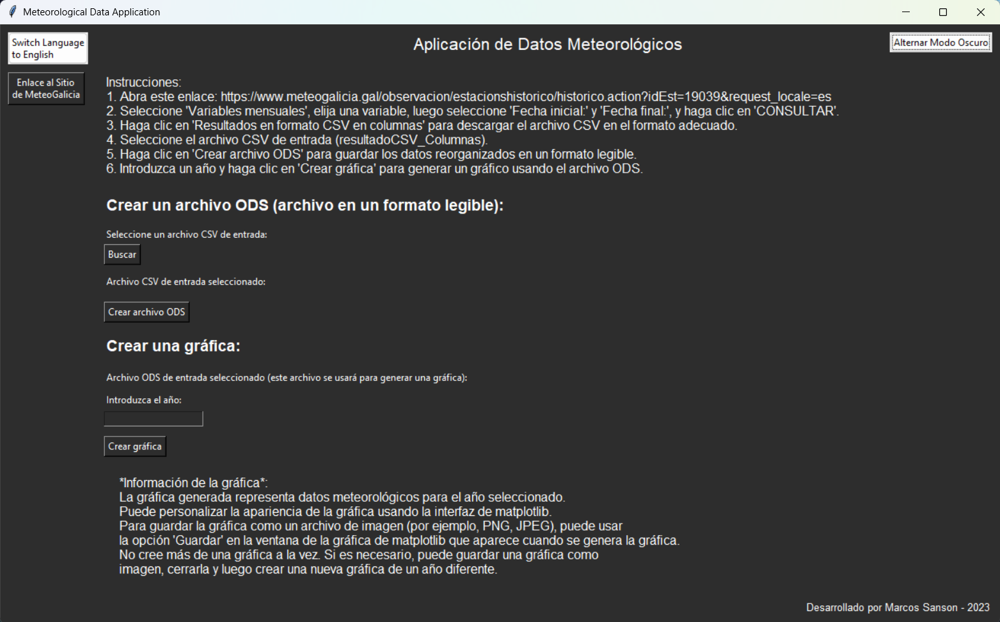
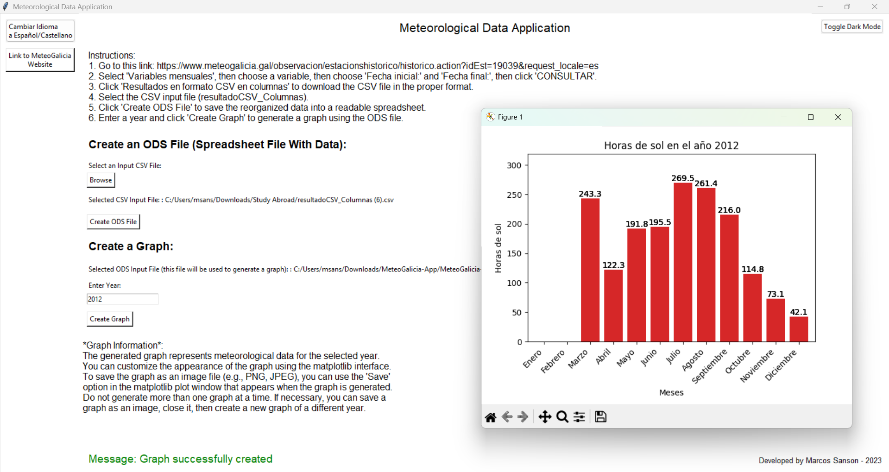

# MeteoGalicia-Application

### [Versión en inglés (English version)](./README.md)

## Descripción General

Esta aplicación procesa datos meteorológicos (desde 2007 hasta el presente) de [MeteoGalicia](https://www.meteogalicia.gal/web/observacion/rede-meteoroloxica/historico), una agencia meteorológica regional en Galicia, España. MeteoGalicia proporciona pronósticos meteorológicos, datos climáticos y monitoreo ambiental para la región. También ofrece registros históricos de diversas variables meteorológicas como temperatura, precipitación, radiación solar y velocidad del viento.

La aplicación permite a los usuarios convertir, analizar y visualizar datos meteorológicos históricos de manera eficiente. Incluye una **interfaz gráfica amigable** para una fácil interacción y **scripts de conversión de datos** para transformar archivos CSV en hojas de cálculo ODS. Los usuarios también pueden generar gráficos basados en tendencias meteorológicas, lo que la convierte en una herramienta valiosa para investigadores, analistas y entusiastas del clima que trabajan con datos climáticos históricos.

### Cambios Recientes
A partir de **2025**, MeteoGalicia ha actualizado su sitio web y **cambiado el formato de su salida de datos CSV**. **Actualmente, esta aplicación no funciona con el nuevo formato CSV** pero sigue siendo funcional con archivos CSV más antiguos.

## Características

- **Interfaz Gráfica Amigable:** La interfaz gráfica permite a los usuarios navegar y seleccionar archivos de entrada, convertir datos y generar gráficos sin esfuerzo.
- **Conversión de Datos:** Convierte **archivos CSV** en **hojas de cálculo ODS** legibles por humanos mediante la reorganización y procesamiento de datos meteorológicos.
- **Generación de Gráficos:** Los usuarios pueden visualizar **tendencias meteorológicas anuales** en un gráfico de barras fácil de leer.
- **Modo Oscuro y Cambio de Idioma:** Alterna entre modo claro/oscuro y cambia entre **inglés** y **español**.
- **Ejecutable Independiente Disponible:** No requiere instalación; solo **ejecuta el archivo `.exe`** (ver abajo).

### Vista Previa de la Interfaz
### Modo Inglés: 
Modo Claro | Modo Oscuro  
:--:|:--:  
 |   

### Modo Español:  
Modo Claro | Modo Oscuro  
:--:|:--:  
 |   

## Instalación y Uso

### **Opción 1: Ejecutar el Ejecutable Independiente (Recomendado)**
- Descarga el ejecutable **`Aplicación - Proyecto de Información Meteorológica.exe`** del repositorio.
- **Asegúrate de que la carpeta `_internal` esté en el mismo directorio** (incluida en el repositorio de GitHub).
- **Ejecuta el archivo `.exe`**, y la interfaz gráfica se iniciará.

### **Opción 2: Ejecutar el Script de Python**
Si prefieres ejecutar el script manualmente:

1. **Clona el Repositorio:**
   ```bash
   git clone https://github.com/yourusername/MeteoGalicia-Application.git
   cd MeteoGalicia-Application
   ```

2. **Instala las Dependencias:**
   ```bash
   pip install -r requirements.txt
   ```

3. **Ejecuta la Aplicación:**
   ```bash
   python gui.py
   ```

## Cómo Usar

1. **Obtén un Archivo CSV** (de datos antiguos de MeteoGalicia):
   - Visita [MeteoGalicia](https://www.meteogalicia.gal/web/observacion/rede-meteoroloxica/historico).
   - Selecciona **"Variables mensuales"**, elige una variable y especifica un rango de fechas.
   - Haz clic en **"CONSULTAR"** y luego descarga **"Resultados en formato CSV en columnas"**.
   - Este archivo CSV es tu **archivo de entrada**.

2. **Convierte el CSV a ODS:**
   - Abre la aplicación.
   - Selecciona el **archivo CSV** como entrada.
   - Haz clic en **"Crear Archivo ODS"** para generar una hoja de cálculo procesada.

#### Ejemplo de Conversión ODS:  
| Ejemplo de Salida ODS |  
|:--:|  
|  |


3. **Genera un Gráfico:**
   - Ingresa un **año** y haz clic en **"Crear Gráfico"** para visualizar tendencias meteorológicas.

#### Ejemplo de Salida de Gráfico:  
  

## Ejemplos de Salidas

Las siguientes imágenes muestran diferentes ejemplos de cómo la aplicación procesa archivos y genera gráficos meteorológicos.

| Ejemplo 1 | Ejemplo 2 |  
|:--:|:--:|  
|  |  |  

| Ejemplo 3 | Ejemplo 4 |  
|:--:|:--:|  
|  |  |  


## Dependencias

Se requieren los siguientes paquetes de Python (instalados a través de `requirements.txt`):
- `pandas`
- `pyexcel_ods3`
- `numpy`
- `matplotlib`
- `tkinter`

## Notas
- **Esta aplicación NO es compatible con el nuevo formato CSV de MeteoGalicia de 2025.** Si encuentras problemas, intenta usar archivos de datos más antiguos.
- Si utilizas el ejecutable independiente, asegúrate de que la **carpeta `_internal` esté en el mismo directorio**.
- Los gráficos proporcionan información sobre **tendencias climáticas históricas** pero pueden requerir preprocesamiento adicional para la compatibilidad con formatos de datos futuros.

## Autor  

Este proyecto fue desarrollado por **[Marcos Sanson](https://github.com/Marcos-Sanson)** durante un **[Programa de Estudio en el Extranjero Dirigido por Profesores de Grand Valley State University en Ourense, España, Verano 2023](https://www.gvsu.edu/studyabroad/faculty-led-programs-2246.htm)**

Para más proyectos y actualizaciones, visita mi GitHub: **[Marcos Sanson](https://github.com/Marcos-Sanson)**