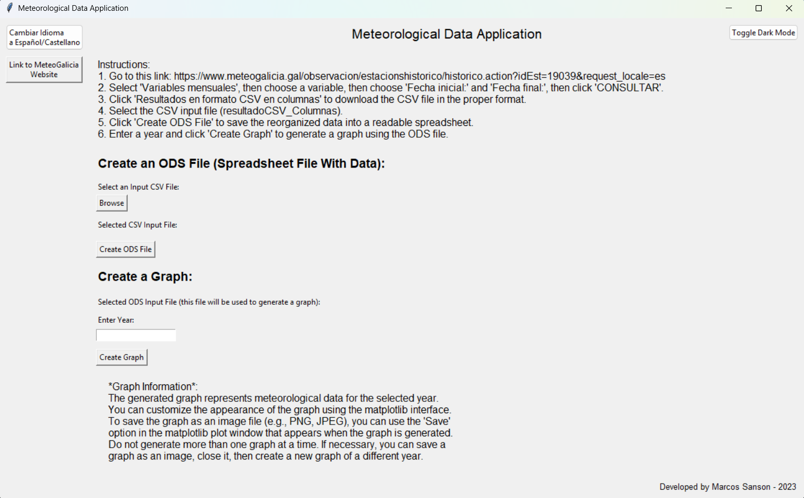
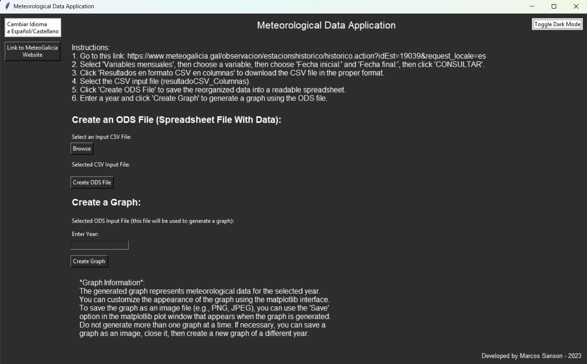
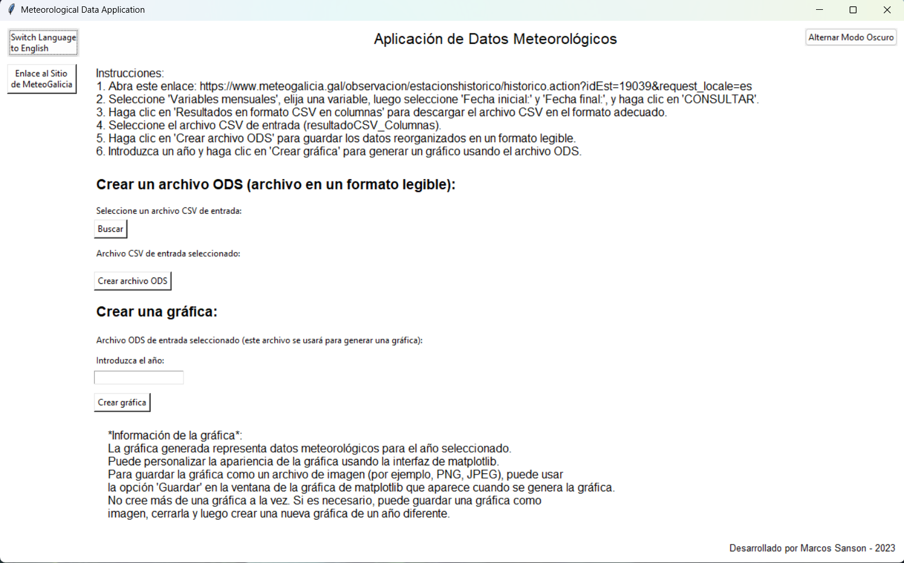
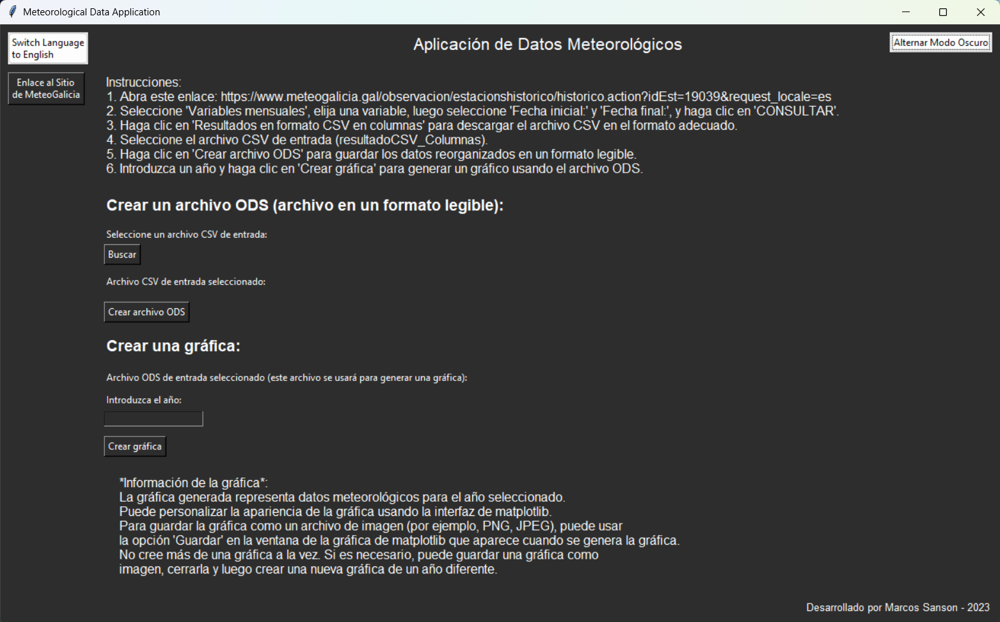
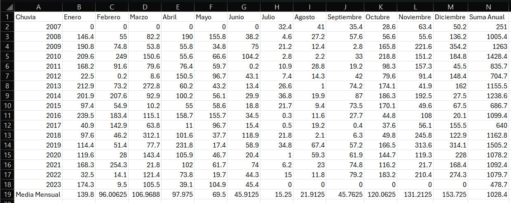
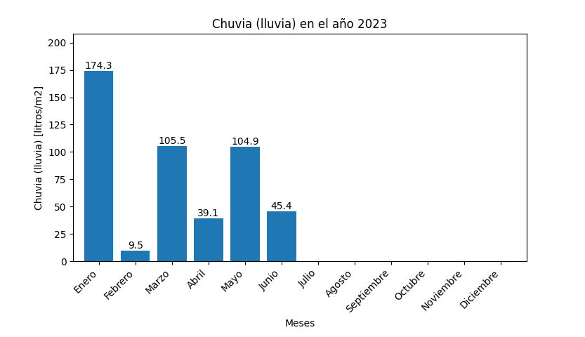
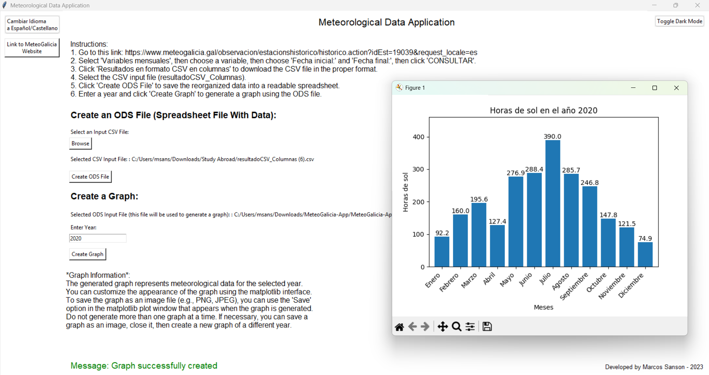
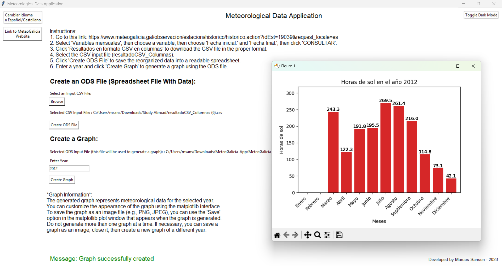
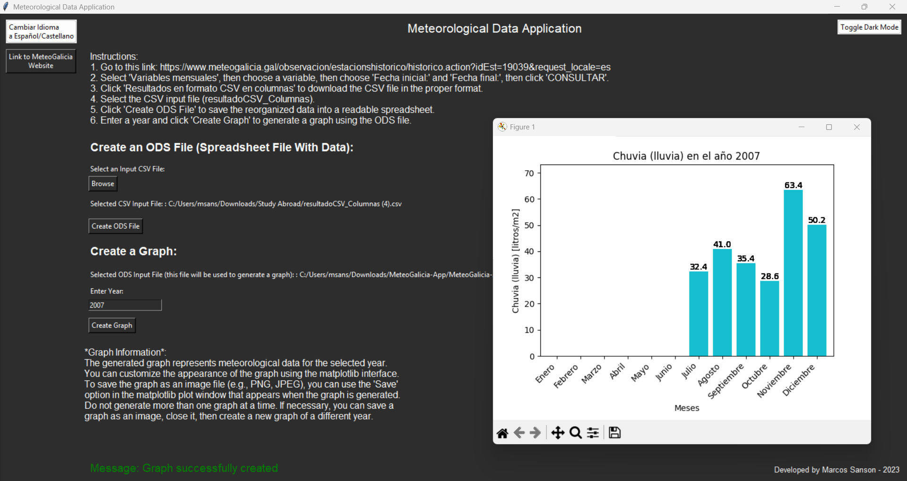
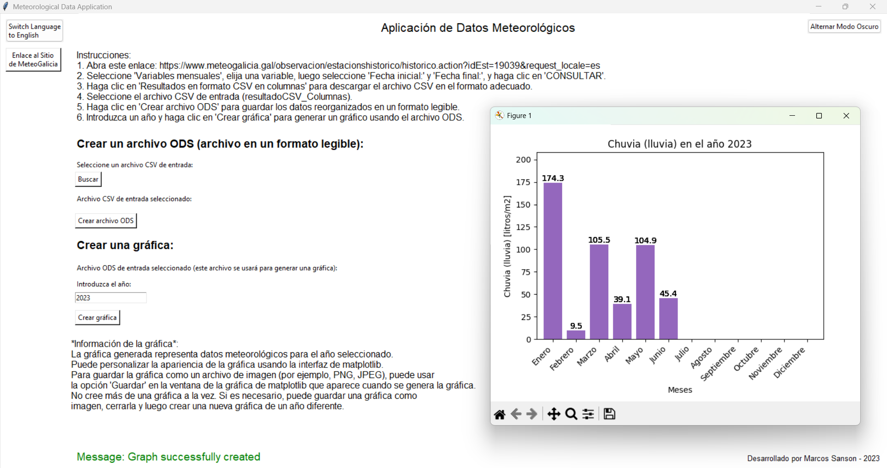

# MeteoGalicia-Application

### [README Version in Spanish/Castilian (versión en español/castellano)](./README-es.md)

## Overview

This application processes meteorological data (from 2007 to present) from [MeteoGalicia](https://www.meteogalicia.gal/web/observacion/rede-meteoroloxica/historico), a regional meteorological agency in Galicia, Spain. MeteoGalicia provides weather forecasts, climate data, and environmental monitoring for the region. It also offers historical records of various meteorological variables such as temperature, precipitation, solar radiation, and wind speed.

The application allows users to convert, analyze, and visualize historical weather data efficiently. It includes a **user-friendly GUI** for easy interaction and **data conversion scripts** to transform CSV files into ODS spreadsheets. Users can also generate graphs based on meteorological trends, making it a valuable tool for researchers, analysts, and weather enthusiasts working with historical climate data.


### Recent Changes  
As of **2025**, MeteoGalicia has updated its website and **changed the format of its CSV data output**. **Currently, this application does not work with the new CSV format** but remains functional with older CSV files.

## Features

- **User-Friendly GUI:** The graphical interface allows users to browse and select input files, convert data, and generate graphs effortlessly.
- **Data Conversion:** Converts **CSV files** into human-readable **ODS spreadsheets** by reorganizing and processing meteorological data.
- **Graph Generation:** Users can visualize **yearly meteorological trends** in an easy-to-read bar chart.
- **Dark Mode & Language Switching:** Toggle between light/dark mode and switch between **English** and **Spanish**.
- **Standalone Executable Available:** No setup required; just **run the `.exe` file** (see below).

### GUI Preview
### English Mode: 
Light Mode | Dark Mode  
:--:|:--:  
 |   

### Spanish Mode:  
Light Mode | Dark Mode  
:--:|:--:  
 |   

## Installation & Usage

### **Option 1: Run the Standalone Executable (Recommended)**
- Download the executable **`Aplicación - Proyecto de Información Meteorológica.exe`** from the repository.
- **Ensure the `_internal` folder is in the same directory** (included in the GitHub repo).
- **Run the `.exe` file**, and the GUI will launch.

### **Option 2: Run the Python Script**
If you prefer to run the script manually:

1. **Clone the Repository:**
   ```bash
   git clone https://github.com/yourusername/MeteoGalicia-Application.git
   cd MeteoGalicia-Application
   ```

2. **Install Dependencies:**
   ```bash
   pip install -r requirements.txt
   ```

3. **Run the Application:**
   ```bash
   python gui.py
   ```

## How to Use

1. **Obtain a CSV File** (from older MeteoGalicia data):
   - Visit [MeteoGalicia](https://www.meteogalicia.gal/web/observacion/rede-meteoroloxica/historico).
   - Select **"Variables mensuales"**, choose a variable, and specify a date range.
   - Click **"CONSULTAR"** and then download **"Resultados en formato CSV en columnas"**.
   - This CSV file is your **input file**.

2. **Convert the CSV to ODS:**
   - Open the application.
   - Select the **CSV file** as the input.
   - Click **"Create ODS File"** to generate a processed spreadsheet.

#### Example ODS Conversion:  
| ODS Output Example |  
|:--:|  
|  |


3. **Generate a Graph:**
   - Enter a **year** and click **"Create Graph"** to visualize meteorological trends.

#### Example Graph Output:  
  

## Example Outputs

The following images showcase different examples of how the application processes files and generates meteorological graphs.

| Example 1 | Example 2 |  
|:--:|:--:|  
|  |  |  

| Example 3 | Example 4 |  
|:--:|:--:|  
|  |  |  


## Dependencies

The following Python packages are required (installed via `requirements.txt`):
- `pandas`
- `pyexcel_ods3`
- `numpy`
- `matplotlib`
- `tkinter`

## Notes
- **This application does NOT support MeteoGalicia's new 2025 CSV format.** If you encounter issues, try using older data files.
- If using the standalone executable, ensure the **`_internal` folder is in the same directory**.
- The graphs provide insights into **historical weather trends** but may require additional preprocessing for compatibility with future data formats.

## Author  

This project was developed by **[Marcos Sanson](https://github.com/Marcos-Sanson)** during a **[Grand Valley State University Summer 2023 Faculty-Led Study Abroad Program in Ourense, Spain](https://www.gvsu.edu/studyabroad/faculty-led-programs-2246.htm)**

For more projects and updates, visit my GitHub: **[Marcos Sanson](https://github.com/Marcos-Sanson)**
